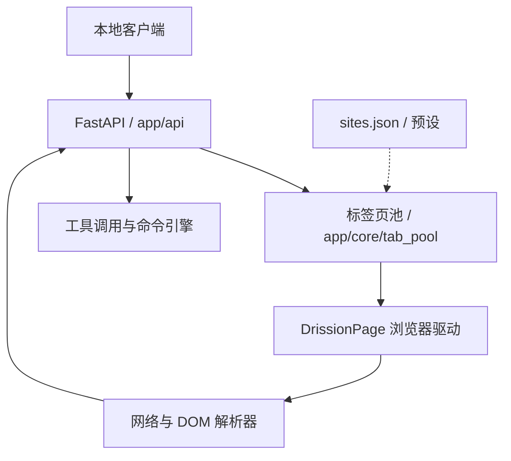

<p align="center">
  
</p>

# Universal Web API

📖 文档 • [English](./README.en.md) • [简体中文](./README.zh-CN.md)

当前版本：**2.9.8**（以 [`VERSION`](./VERSION) 和 [`CHANGELOG_CURRENT.md`](./CHANGELOG_CURRENT.md) 为准）

Universal Web API 是一个运行在本机的 API 桥接与调试工具。它接管浏览器中已经登录的 AI 网页（ChatGPT、DeepSeek、Gemini、Claude 等），将网页对话转换为 OpenAI / Anthropic 兼容接口，供本地客户端、酒馆、脚本和工作流调用。

它不会创建或出售账号、额度。所有请求都会经过受控浏览器页面，网页端的登录态、限流、验证码和模型可用性仍由目标站点决定。

> ⚠️ **合规与安全**：仅使用自己有权使用的账号，并遵守目标站点服务条款。项目不提供绕过登录、验证码、付费墙或安全机制的功能。默认只建议绑定到 `127.0.0.1`，不要在没有认证和访问控制的情况下暴露到公网。

## 本 fork 的定位：安全本地 Codex Desktop 网页桥接

本 fork 基于原项目 [`lumingya/universal-web-api`](https://github.com/lumingya/universal-web-api)。感谢原作者 **lumingya** 以及所有上游贡献者完成浏览器自动化、站点适配、流式解析、路由、控制面板和 OpenAI / Anthropic 兼容层。没有这些基础工作，本分支的 Codex Desktop 实验无法开展。

`security-hardening` 分支围绕一个更窄的目标继续改造：保留上游网页桥接能力，收紧本地安全边界，并研究让 **Codex Desktop 使用网页对话模型进行推理，同时继续由 Codex 客户端在自己的沙箱与授权策略下执行本地文件和命令工具**。

目标链路：

```text
Codex Desktop
    -> OpenAI Responses request
    -> Universal Web API on 127.0.0.1
    -> controlled browser tab
    -> web chat model decides whether a client tool is needed
    -> UWA converts the decision to Responses function_call
    -> Codex executes the local tool under its sandbox/approval policy
    -> function_call_output returns through UWA to the web model
    -> repeat until the task is complete
```

网页模型本身不获得直接文件系统权限。`exec_command`、文件读写、测试等动作应继续由 Codex 客户端执行。UWA 只负责协议转换、网页交互和模型决策转译。

### 当前 Codex Desktop 状态

已实测：

- hardened localhost 启动与独立受控浏览器 Profile
- `/health`、`/v1/models` 和 Provider 状态
- OpenAI Chat Completions
- OpenAI Responses 非流式请求
- Responses SSE streaming
- Codex 0.153+ `client_version` 模型目录兼容
- Codex CLI 自定义 provider 推理
- Codex Desktop 加载 `uwa` 自定义 provider 并完成普通推理

正在验证：

- `exec_command` 等核心本地工具的完整多轮调用
- 网页模型错误回复“无法访问本机文件”时的自动纠正
- 本地文件读取、修改、测试和后续 `function_call_output` 循环

待解决：

- Responses continuation state 持久化。当前状态仍是进程内存数据，重启会丢失
- 更准确的 token/context 估算和长上下文稳定性测试
- ChatGPT Temporary Chat 类隔离方案，减少普通账号 Memory / 历史与 coding agent 相互影响
- reasoning effort 到网页 UI 的真实映射
- MCP、插件、namespace tools、多 Agent 等高级 Codex 能力的逐项兼容

完整阶段记录见 [`docs/CODEX_WEB_BRIDGE_PROGRESS.md`](./docs/CODEX_WEB_BRIDGE_PROGRESS.md)。

### 模型名称与 reasoning 说明

Codex 中的 `chatgpt` 是浏览器路由 ID。对于 `chatgpt.com` 路由，**受控浏览器当前实际选中的网页模型才是实际推理模型的来源**。因此 `chatgpt` 本身不能证明具体使用了哪个 ChatGPT 网页模型。

本分支目前只向 Codex 声明一个 `medium` / Web default reasoning 占位级别。Responses 请求里的 `reasoning.effort` 还没有稳定映射到 ChatGPT 网页“思考强度”控件，所以不会再把 `low/high/ultra` 显示成已经生效的能力。

### 公开仓库安全提示

这个 fork 是 public repository。提交代码前请阅读 [`SECURITY.md`](./SECURITY.md)。尤其不要提交：

- `.env`、API Token、密码、Cookie 或任何登录凭证
- `chrome_profile/` 或浏览器 Local Storage
- 包含私有代码、聊天内容、账号信息的日志和截图
- 本地请求历史、命令结果或未来的 Responses SQLite 状态库
- 任何可以控制受控浏览器的 DevTools 会话信息

默认保持 `127.0.0.1`、关闭 CORS、关闭 Debug、关闭 unsafe Python、关闭自动更新。DevTools `9222` 必须只留在本机。Codex 的本地执行权限也不应为了兼容测试而放宽到日常无提示全盘访问。

## 功能概览

- OpenAI 兼容：`/v1/chat/completions`、`/v1/models`；实验性支持 `/v1/responses`。
- Anthropic 兼容：`/v1/messages`、`/v1/messages/count_tokens`，同时接受 `Authorization` 和 `x-api-key`。
- 多种路由：自动分配、站点域名、固定标签页、精确 URL、URL 绑定预设和路由组。
- 流式 SSE、工具调用转译与参数纠错、多模态输入/媒体回传、超长文本文件粘贴。
- 标签页池生命周期管理、请求历史、日志、选择器测试和浏览器状态诊断。
- 通过 `config/sites.json`、预设和控制面板热更新站点工作流。

### 已适配站点

| 站点 | 网址 | 备注 |
| --- | --- | --- |
| ChatGPT | `chatgpt.com` | 支持长上下文与流式回复 |
| DeepSeek | `chat.deepseek.com` | 支持深度思考流提取 |
| Gemini | `gemini.google.com` | 多模态交互测试 |
| Claude | `claude.ai` | 页面交互与附件上传 |
| Kimi | `www.kimi.com` | 长上下文文件粘贴 |
| 通义千问 | `chat.qwen.ai` | 网页自动化适配 |
| Grok | `grok.com` | 原生网页流解析 |
| 豆包 | `www.doubao.com` | 页面结构适配 |
| AI Studio | `aistudio.google.com` | 开发者吞吐测试 |
| Arena AI | `arena.ai` | 盲测对比，受出口 IP 质量影响 |

未收录站点可在控制面板使用“新增站点”流程，根据 DOM 生成并逐项验证规则；这不会绕过验证码或访问控制。

### 架构简图



## 工作原理

客户端请求 -> FastAPI 路由 (`app/api`) -> 标签页池调度 (`app/core/tab_pool`) -> DrissionPage 驱动浏览器 (`app/core/workflow`) -> 网络/DOM 解析 (`app/core/parsers`) -> 标准 JSON 或 SSE 响应。浏览器配置目录、日志、下载媒体和站点规则默认都保留在项目目录内。

## 快速开始

### 环境要求

- Python 3.10 或更高版本（启动脚本可按 `.env` 中的 `PYTHON_INSTALL_VERSION` 自动准备环境）。
- Chrome、Edge 或 Brave 等 Chromium 浏览器。建议使用项目创建的独立 `chrome_profile`，不要与日常浏览器共用配置目录。
- Windows 支持最完整；macOS/Linux 支持核心功能，文件剪贴板和窗口控制能力可能受系统限制。

### 启动

1. 上游发布版本可从 [原项目 Releases](https://github.com/lumingya/universal-web-api/releases) 下载。使用本 fork 的 `security-hardening` 分支时建议从源码运行并先审阅 diff。
2. Windows 可使用上游启动流程；macOS/Linux 在项目根目录执行 `python3 start.py`。直接运行 `python main.py` 不会获得 hardened launcher 的启动安全检查。
3. 首次启动会校验/安装 `requirements.txt`，启动受控浏览器，并在普通浏览器打开控制面板：`http://127.0.0.1:8199/`。
4. 在受控浏览器登录目标 AI 网站，停留在可输入消息的对话页面。控制面板和教程请用普通浏览器访问。
5. 在客户端填写 Base URL `http://127.0.0.1:8199/v1`，模型名从 `GET /v1/models` 返回值中选择。

### 从源码安装（可选）

```bash
python -m venv venv
# Windows: venv\\Scripts\\activate
# macOS/Linux: source venv/bin/activate
python -m pip install -r requirements.txt
python start.py
```

启动后可用以下地址确认服务：

```bash
curl http://127.0.0.1:8199/health
curl http://127.0.0.1:8199/v1/models
```

若启用了认证，在每个请求中加入 `-H "Authorization: Bearer YOUR_TOKEN"` 或 `-H "X-API-Key: YOUR_TOKEN"`。

## API 使用

### OpenAI Chat Completions

```bash
curl http://127.0.0.1:8199/v1/chat/completions \
  -H "Content-Type: application/json" \
  -d '{"model":"YOUR_MODEL_ID","messages":[{"role":"user","content":"你好"}],"stream":false}'
```

将 `stream` 改为 `true` 即可获得 `text/event-stream`。启用认证后再增加 `-H "Authorization: Bearer YOUR_TOKEN"` 或 `-H "X-API-Key: YOUR_TOKEN"`；不要把示例占位值当成真实令牌。支持 `temperature`、`max_tokens`、`stop`、`response_format`、`tools`、`tool_choice`、`parallel_tool_calls` 和 `preset_name` 等常用字段；网页端不支持的字段会被适配或忽略。

Windows PowerShell 可用结构化对象生成 JSON，避免引号转义问题：

```powershell
$body = @{ model = 'YOUR_MODEL_ID'; messages = @(@{ role = 'user'; content = '你好' }); stream = $false } | ConvertTo-Json -Depth 10
Invoke-RestMethod 'http://127.0.0.1:8199/v1/chat/completions' -Method Post -ContentType 'application/json' -Body $body
```

### OpenAI Responses（实验性）

`POST /v1/responses` 接受 `model`、`input`、`instructions`、`tools`、`stream` 等字段，并将请求转换到同一套网页调度流程。Codex Desktop/CLI 兼容仍处于实验阶段。普通推理、Responses SSE 和模型目录已经完成实测；完整本地 coding tool loop 仍需通过真实工作区验收。

### Anthropic Messages

`POST /v1/messages` 与 `POST /v1/messages/count_tokens` 兼容 Claude Code 常见请求格式。认证头可使用 `x-api-key: YOUR_TOKEN`；流式模式返回 Anthropic SSE 事件。图片可使用 Anthropic `source.type=base64` 或 URL，工具定义会转换为本地工具调用提示。

### 模型和运行状态

| 方法 | 路径 | 用途 |
| --- | --- | --- |
| GET | `/health` | 服务与浏览器基础健康检查 |
| GET | `/v1/models` | 当前标签页/预设暴露的模型目录 |
| GET | `/v1/provider/capabilities` | 协议、功能和模型能力清单 |
| GET | `/v1/provider/status` | 浏览器连接、标签页池和请求状态（不含密钥） |
| GET | `/api/pool/status` | 标签页池详细状态 |

### 路由写法

默认入口会根据模型目录自动选择标签页。需要稳定绑定时使用下列路径（路径中的域名应与站点配置一致）：

| 场景 | 示例 |
| --- | --- |
| 指定站点 | `POST /url/gemini.google.com/v1/chat/completions` |
| 指定站点和预设 | `POST /url/gemini.google.com/pro/v1/chat/completions` |
| 指定标签页 | `POST /tab/2/v1/chat/completions` |
| 指定站点+标签页 | `POST /url/gemini.google.com/v1/chat/completions?tab_index=2` |
| 精确 URL 会话 | `POST /tab-url/{url_token}/v1/chat/completions` |
| 路由组 | `POST /group/{group_id}/v1/chat/completions` |

也可以在请求体中传 `preset_name`，或在域名路由 URL 上用同名查询参数临时覆盖预设。完整参数和控制台操作见 [本地教程](./static/tutorial/index.html#quickstart)。

## 配置

复制 `.env.example` 为 `.env` 后按需修改。空值和非法数字通常会回落到默认值；修改环境变量后请重启服务。

下表的“默认/示例”会同时覆盖代码回退值与仓库模板值；如果你复制了 `.env.example`，以模板中的显式值为准。

| 变量 | 默认/示例 | 说明 |
| --- | --- | --- |
| `APP_HOST` | `127.0.0.1` | 监听地址。局域网共享才使用 `0.0.0.0`，并同时启用认证和防火墙。 |
| `APP_PORT` | `8199` | API、控制面板和教程端口。 |
| `APP_DEBUG` | `false` | `true` 开启 `/docs`、`/redoc` 和更详细错误；共享环境应关闭。 |
| `AUTH_ENABLED` / `AUTH_TOKEN` | `false` / 空 | API Bearer 或 `X-API-Key` 认证；启用时必须设置强令牌。 |
| `DASHBOARD_AUTH_ENABLED` / `DASHBOARD_AUTH_TOKEN` | 跟随 API / 空 | 控制面板与管理接口认证，可使用独立令牌。 |
| `CORS_ENABLED` / `CORS_ORIGINS` | `false` / `http://127.0.0.1:8199` | 默认关闭跨域；确需跨域时再打开，并改为明确来源列表。 |
| `BROWSER_PORT` | `9222` | 受控浏览器 DevTools 端口，只允许本机访问。 |
| `BROWSER_PATH` / `BROWSER_PROFILE_DIR` / `BROWSER_PROFILE_NAME` | 自动 / 项目目录 / `Default` | 自定义浏览器和独立用户目录。Chrome 136+ 不要直接复用系统默认 User Data。 |
| `SITES_CONFIG_FILE` | `config/sites.json` | 站点、工作流、标签页路由和预设配置。 |
| `PROXY_ENABLED` / `PROXY_ADDRESS` / `PROXY_BYPASS` | 按需 | HTTP/SOCKS5 代理及绕过列表。 |
| `PROFILE_CLEAN_ENABLED` | `false` | 是否在启动时清理受控浏览器缓存；需要保留调试数据时保持关闭。 |
| `SCHEDULED_RESTART_ENABLED` | `false` | 定时平滑重启服务。长请求较多时请合理设置排空超时。 |
| `TOOL_CALLING_CLIENT_WORKSPACE_REPAIR` | `true` | 当网页模型错误声称无法访问本地工作区，而客户端已声明本地工具时，进行有限聚焦修复。不会执行命令或绕过 Codex 权限。 |
| `TOOL_CALLING_PROMPT_PADDING_ENABLED` | `false` | hardened Codex 工作流默认关闭额外 few-shot/padding，减少网页 prompt 上下文开销。 |

站点规则、提取器、解析器、图片预设等 JSON 配置也可在控制面板中编辑。修改前建议使用设置页的备份功能，并保留 `chrome_profile`、`config`、`.env` 和 `logs` 的本地副本。任何包含登录态或私有内容的副本都不要提交到公开仓库。

## 控制面板与教程

启动后打开 `/`，可以查看浏览器连接、标签页池、请求历史、日志和系统统计。完整教程位于 [`static/tutorial/index.html`](./static/tutorial/index.html)，重点章节如下：

- [快速开始](./static/tutorial/index.html#quickstart)：受控浏览器、首次登录和 Gemini 示例。
- [连接 API 与路由](./static/tutorial/index.html#connect)：Base URL、模型、域名/标签页/URL 路由和 curl 示例。
- [API 端点速查](./static/tutorial/index.html#api-reference)：健康检查、Provider 能力、OpenAI/Responses/Anthropic 端点与认证头。
- [请求监控与排障](./static/tutorial/index.html#dashboard)：查看阶段性错误、取消卡住请求和释放标签页。
- [选择器与工作流](./static/tutorial/index.html#selectors)：CSS 选择器、发送步骤、流式监听与 DOM 回退。
- [预设与标签页池](./static/tutorial/index.html#presets) / [标签页池](./static/tutorial/index.html#tabpool)：并发、分配模式、会话隔离和超时。
- [多模态、文件粘贴和工具调用](./static/tutorial/index.html#multimodal)：附件限制、媒体回传和参数自愈边界。
- [新增站点](./static/tutorial/index.html#addsite)：通过 DOM 分析生成规则并逐字段验证。
- [设置与 FAQ](./static/tutorial/index.html#settings) / [常见问题](./static/tutorial/index.html#faq)：环境变量、浏览器复用和常见错误。
- [安全边界](./static/tutorial/index.html#security-boundary)：本机监听、令牌、CORS、DevTools 端口和敏感数据处理。

## 故障排查

1. **打不开控制面板**：确认 `start.py` 进程仍在运行，检查 `APP_HOST`/`APP_PORT`，并访问 `/health`。端口被占用时先确认是否已有 UWA 实例正在监听。
2. **没有可用标签页**：确认受控浏览器已启动、已登录并停留在目标站点；检查 `/v1/provider/status` 的 `browser.connected` 和 `pool.idle`。
3. **请求排队超时/429**：标签页都在忙或 `acquire_timeout` 太短。降低并发、增加标签页，或调整标签页池分配策略。
4. **首包超时但页面有回复**：站点网络格式可能变化。先查看请求监控，再测试选择器；网络监听满足条件时会回退到 DOM 解析。
5. **回复为空或立即 DONE**：更新浏览器内核，确认页面没有停在登录、验证码或错误页；检查选择器和 `stream` 配置。
6. **401/认证失败**：确认 `AUTH_ENABLED` 与 `AUTH_TOKEN` 成对设置，使用 `Authorization: Bearer ...` 或 `X-API-Key`；不要把 Dashboard 令牌当作 API 令牌。
7. **附件/媒体失败**：检查文件大小、后缀和 `temp`/`download_images` 权限；音频转码需要安装 `ffmpeg`。
8. **浏览器无法接管**：关闭占用 `BROWSER_PORT` 的其他 Chrome，或修改端口；Chrome 136+ 请使用项目独立 Profile。
9. **Codex 返回“无法访问本机文件”并给出手工命令**：确认当前分支包含 client workspace repair，客户端请求中确实暴露了 `exec_command` 等工具，并查看日志是否出现 `客户端工作区工具拒绝修复`。重复失败会主动报错，避免把未执行的命令当作成功结果。

提交 Issue 前请附上操作系统、Python/浏览器版本、请求路径（隐藏令牌和隐私内容）、错误日志，以及 `/v1/provider/status` 的脱敏结果。不要上传 Cookie、完整浏览器 Profile、API 密钥、聊天原文或私有源码。

## 安全边界与数据处理

- 本服务按单机调试和实验工作流设计，不提供多租户隔离、计费、审计或高可用保证，不应直接作为公网生产网关。
- `APP_HOST=0.0.0.0` 会让 API 和管理接口监听所有网卡；hardened launcher 会要求显式远程授权和额外安全条件。远程场景仍应配置防火墙、强令牌和可信网络。
- DevTools 端口（默认 `9222`）可控制整个受控浏览器，必须限制为回环地址，禁止端口转发和公网暴露。
- 请求日志、媒体文件、临时附件和浏览器登录态可能包含敏感数据。按需关闭详细日志，定期清理 `logs`、`temp`、`download_images`，并保护 `chrome_profile`。
- 代理、辅助 AI、自动更新和命令引擎可能产生额外网络或本地执行行为；只配置自己信任的地址和脚本。
- Codex tool calling 的网页模型输出只应视为工具请求。真正本地执行继续受 Codex sandbox/approval 控制。不要为了兼容实验关闭这层边界。
- Responses continuation 当前仍包含进程内敏感上下文。未来若增加 SQLite 持久化，数据库必须保持本地、受权限保护并继续 Git ignore。

更完整的公开仓库安全策略见 [`SECURITY.md`](./SECURITY.md)。

## 反馈、许可证与免责声明

上游项目问题和通用功能建议请优先参考 [lumingya/universal-web-api](https://github.com/lumingya/universal-web-api) 及其 [Issues](https://github.com/lumingya/universal-web-api/issues)。本 fork 中与 hardened launcher、Codex Desktop、自定义 Responses provider 和安全边界相关的问题可在本仓库记录，提交前请脱敏日志和账号信息。

再次感谢 **lumingya** 和上游贡献者提供原始项目。本 fork 会尽量保持上游核心网页桥接逻辑可同步，把 Codex 兼容与安全改造隔离在可审查的代码和文档中。

本项目继续遵循 [AGPL-3.0](./LICENSE)。使用者应自行评估目标网站服务条款、账号风险、数据隐私和实验性兼容性；维护者不提供可用性或账号安全保证。
